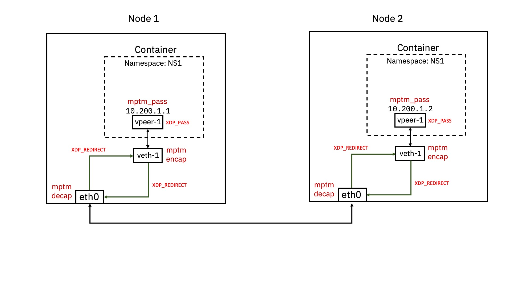

# MPTM

This repository contains code for **Multi Protocol Tunnel Multiplexer (MPTM)** implemented using [ebpf](https://ebpf.io/).
MPTM implements code for multiple tunnel protocols and hooks them in linux at [XDP](https://www.iovisor.org/technology/xdp) hook points.

For detailed description of depedencies, intent, usage etc. please check the blogs:

1. [Towards building an eBPF Based Network Data Plane](https://medium.com/@palani.kodeswaran/towards-building-a-ebpf-based-network-datapath-f6135067c03e)
1. [Towards building an eBPF based Newtork Data plane: Part 2](https://medium.com/@palani.kodeswaran/towards-an-ebpf-based-datapath-part-2-2afd10ada603)

## Based on libbpf

This code leverages [libbpf](https://github.com/libbpf/libbpf/).

## Build

Run ``make`` in root folder.

# How to Run


We provide setup files to create a test system

[setup-node.sh](./setup/setup-node.sh) is the script which contains bash script to setup system.

[env-node1.sh](./setup/env-node1.sh) [env-node2.sh](./setup/env-node2.sh) is the environment to set them up.


## Attaching MPTM implementation to interfaces:

Load the bpf programs
```
$ bpftool prog loadall build/mptm.o /sys/fs/bpf/mptm type xdp -d
$ bpftool prog loadall build/mptm_extras.o /sys/fs/bpf/mptm_extras type xdp -d
$ ls /sys/fs/bpf/
mptm  mptm_extras
$ bpftool prog show
780: xdp  name mptm_encap_xdp  tag 20ce27c6fc8477bf  gpl
        loaded_at 2022-09-27T08:56:09+0000  uid 0
        xlated 2928B  jited 1600B  memlock 4096B  map_ids 465,466,467
        btf_id 590
781: xdp  name mptm_decap_xdp  tag de198a4b68746d76  gpl
        loaded_at 2022-09-27T08:56:09+0000  uid 0
        xlated 1416B  jited 866B  memlock 4096B  map_ids 465,466,467
        btf_id 590
785: xdp  name mptm_redirect  tag 45631072cbc131ed  gpl
        loaded_at 2022-09-27T08:56:32+0000  uid 0
        xlated 64B  jited 44B  memlock 4096B  map_ids 468
        btf_id 595
786: xdp  name mptm_pass  tag 3b185187f1855c4c  gpl
        loaded_at 2022-09-27T08:56:32+0000  uid 0
        xlated 16B  jited 18B  memlock 4096B
        btf_id 595
```

Attach to the interfaces

```
$ bpftool net attach xdp id 780 dev veth-node1 overwrite
$ bpftool net attach xdp id 781 dev ens4f0 overwrite
```

```
$ ip a | ack --passthru 'xdp'
2: ens4f0: <BROADCAST,MULTICAST,UP,LOWER_UP> mtu 3000 xdp/id:781 qdisc mq state UP group default qlen 1000
    link/ether 68:05:ca:d4:7c:ac brd ff:ff:ff:ff:ff:ff
    altname enp88s0f0
    inet 10.30.30.1/32 scope global ens4f0
       valid_lft forever preferred_lft forever
    inet6 fe80::6a05:caff:fed4:7cac/64 scope link 
       valid_lft forever preferred_lft forever
146: veth-node1@if145: <BROADCAST,MULTICAST,UP,LOWER_UP> mtu 3000 xdp/id:780 qdisc noqueue state UP group default qlen 1000
    link/ether 62:d6:7b:d3:e8:9f brd ff:ff:ff:ff:ff:ff link-netns vns1
    inet6 fe80::60d6:7bff:fed3:e89f/64 scope link 
       valid_lft forever preferred_lft forever
```

Note:- As per [Netdev 0x13](https://legacy.netdevconf.info/0x13/) talk [Veth XDP: XDP for containers](https://www.files.netdevconf.info/f/a63b274e50f943a0a474/?dl=1) we need to attach an XDP Program to the `vpeer` and redirect pakcets to `veth` for optimal performance.

So we attach `XDP_PASS` to the `veth-peer` interface as follows.

```
$ ip netns exec vns1 bpftool net attach xdp id 786 dev veth-ns1 overwrite
```

## Programming the maps

Check the maps created using below command
```
$ bpftool map show
465: hash  name mptm_tunnel_inf  flags 0x0
        key 8B  value 64B  max_entries 1024  memlock 151552B
466: devmap  name mptm_tunnel_red  flags 0x80
        key 4B  value 4B  max_entries 2048  memlock 16384B
467: percpu_array  name xdp_stats_map  flags 0x0
        key 4B  value 16B  max_entries 5  memlock 8192B
468: devmap  name mptm_redirect_d  flags 0x80
        key 4B  value 4B  max_entries 1024  memlock 8192B
473: array  flags 0x0
        key 4B  value 32B  max_entries 1  memlock 4096B
475: array  name pid_iter.rodata  flags 0x480
        key 4B  value 4B  max_entries 1  memlock 8192B
        btf_id 605  frozen
        pids bpftool(2019515)
476: array  flags 0x0
        key 4B  value 32B  max_entries 1  memlock 4096B
```

Notice the `mptm_*` maps needed by `mptm` and `mptm_extras` programs

Now pin the maps using these commands below, the map ids are taken from map show command, notice that the `bpftool prog show`
command output lists the *map_ids* being used by the programs, if you see multiple maps then use those *ids* below which are
listed with program.

```
$ bpftool map pin id 465 /sys/fs/bpf/mptm_tunnel_info_map
$ bpftool map pin id 466 /sys/fs/bpf/mptm_redirect_if_devmap
$ ls /sys/fs/bpf/
mptm  mptm_extras  mptm_redirect_if_devmap  mptm_tunnel_info_map
```

We need to populate the maps with information regarding tunnel outer packet header, ip address to mangle, mac addresses and interfaces to look for.
We will use the [`mptm_user`](./src/user/mptm_user.c)  binary we compiled in the [build](#build) step to do that.

The binary `mptm_user` needs [libbpf](./deps/libbpf/) shared library for running which gets compiled on your system the
first time you run `make`.

The command is run as,

```
$ ./build/mptm_user --enable_logs 0 \
                    --redirect 1 \
                    --eth0_iface 2 \
                    --veth_iface 146 \
                    --vpeer_iface 145 \
                    --flags 0 \
                    --tunnel GENEVE \
                    --vlid 0 \
                    --source_port 51234 \
                    --source_ip 10.30.30.1 \
                    --source_mac 68:05:ca:d4:7c:ac \
                    --dest_ip 10.30.30.2 \
                    --dest_mac 68:05:ca:d4:5c:28 \
                    --inner_dest_mac 9e:5c:c2:da:ee:5b \
                    --inner_src_ip 10.250.1.100 \
                    --inner_dst_ip 10.250.1.101 \
                    -a ADD
opt: l arg: 0 
opt: r arg: 1 
opt: Z arg: 2 
opt: Y arg: 146 
opt: X arg: 145 
opt: f arg: 0 
opt: t arg: GENEVE 
opt: v arg: 0 
opt: p arg: 51234 
opt: s arg: 10.30.30.1 
opt: S arg: 68:05:ca:d4:7c:ac 
opt: d arg: 10.30.30.2 
opt: D arg: 68:05:ca:d4:5c:28 
opt: M arg: 9e:5c:c2:da:ee:5b 
opt: x arg: 10.250.1.100 
opt: y arg: 10.250.1.101 
opt: a arg: ADD 
Arguments verified
Opened bpf map file /sys/fs/bpf/mptm_tunnel_info_map at fd 3
Opened bpf map file /sys/fs/bpf/mptm_redirect_if_devmap at fd 4
Creating tunnel info object......created
action is add, map fd 3 adding mptm_tunnel_info_map entry
action is add, map fd 4 adding mptm_redirect_if_devmap entry
action is add, map fd 4 adding mptm_redirect_if_devmap entry

```

Check if map entry got created by - 

```
$ bpftool map show
465: hash  name mptm_tunnel_inf  flags 0x0
        key 8B  value 64B  max_entries 1024  memlock 151552B
466: devmap  name mptm_tunnel_red  flags 0x80
        key 4B  value 4B  max_entries 2048  memlock 16384B
467: percpu_array  name xdp_stats_map  flags 0x0
        key 4B  value 16B  max_entries 5  memlock 8192B
468: devmap  name mptm_redirect_d  flags 0x80
        key 4B  value 4B  max_entries 1024  memlock 8192B
477: array  flags 0x0
        key 4B  value 32B  max_entries 1  memlock 4096B
479: array  name pid_iter.rodata  flags 0x480
        key 4B  value 4B  max_entries 1  memlock 8192B
        btf_id 610  frozen
        pids bpftool(2020270)
480: array  flags 0x0
        key 4B  value 32B  max_entries 1  memlock 4096B
$ bpftool map dump id 465
key:
0a fa 01 64 0a fa 01 65
value:
00 03 01 00 00 02 00 00  00 92 00 00 00 00 00 00
00 00 00 00 00 00 00 00  c8 22 00 00 0a 1e 1e 02
0a 1e 1e 01 9e 5c c2 da  ee 5b 68 05 ca d4 7c ac
68 05 ca d4 5c 28 00 00  00 00 00 00 00 00 00 00
Found 1 element
```

and so on...

You can also view the entries which got added by running a lookup via `mptm_user`

```
$ ./build/mptm_user --inner_src_ip 10.250.1.100 --inner_dst_ip 10.250.1.101 -a GET
opt: x arg: 10.250.1.100 
opt: y arg: 10.250.1.101 
opt: a arg: GET 
Arguments verified
Opened bpf map file /sys/fs/bpf/mptm_tunnel_info_map at fd 3
Opened bpf map file /sys/fs/bpf/mptm_redirect_if_devmap at fd 4
Tunnel info element - {
        debug = 0
        redirect = 1
        flags = 0
        eth0_iface = 2
        veth_iface = 146
        tunnel_type = GENEVE
        vlan_id = 0
        source_port = 8904
        source_mac = 68:5:ca:d4:7c:ac
        outer_dest_mac = 68:5:ca:d4:5c:28
        inner_dest_mac = 9e:5c:c2:da:ee:5b
        dest_ip = 10.30.30.2
        source_ip = 10.30.30.1
}
Ingrese redirect is from iface 0 to 2
Egrese redirect is from iface 0 to 146
```

In case you need to delete the entry action can be set to `DEL`

```
$ ./build/mptm_user --inner_src_ip 10.250.1.100 --inner_dst_ip 10.250.1.101 -a DEL
```

## Generating Traffic:
```
ip netns exec vns1 ping 10.250.1.101
```

## Show packets coming on xdp interface
```
$ xdpdump -i veth-node1 -x --rx-capture entry,exit
```

# License
Our program is present under GPL 2.0 license.

If separate license terms are needed for any file it is mentioned on top of the file.

# Extra

* Command to flush iptables completely

```
iptables -F && iptables -t nat -F && iptables -t mangle -F && iptables -X
```

* If the `libbpf` library doesn't load then to pass shared libary to the binary at runtime you can use this command,

```
export LD_LIBRARY_PATH=${PWD}/deps/libbpf/src
```

run from inside the root directory of project.

* ip tables command to add checksum fill inside the container.

```
iptables -A POSTROUTING -j CHECKSUM --checksum-fill
```
